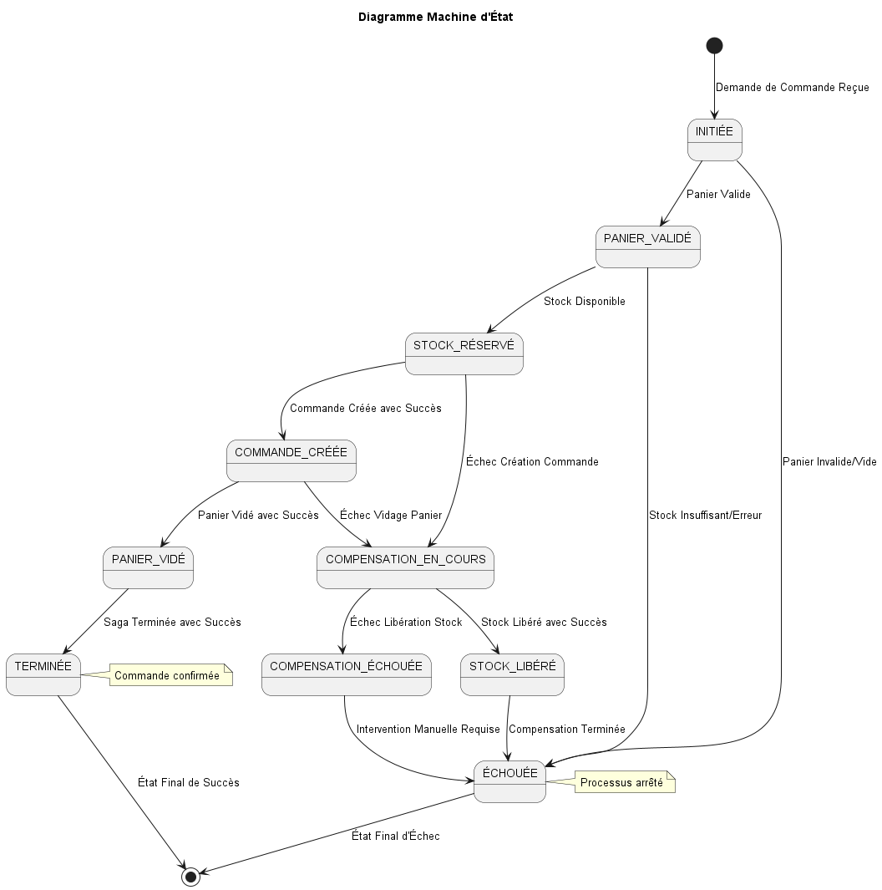
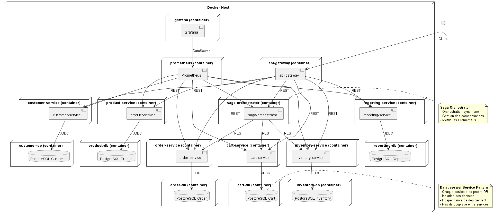
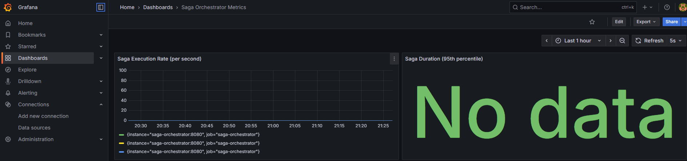

#Nom : youcef mekki daouadji 
lien github : https://github.com/Mdyoucef99/LAB6_LOG430

Rapport d'architecture  – LAB6 Saga Orchestration

## 1. Introduction et objectifs
Ce projet LAB6 étend l'architecture microservices du LAB5 en implémentant le pattern **Saga Orchestration** pour gérer les transactions distribuées. L'objectif est de garantir la cohérence des données à travers plusieurs microservices lors du processus de commande, tout en maintenant la simplicité et l'observabilité du système.

## 2. Contraintes
- Utilisation de Java 21 et Spring Boot 3.x
- **Pattern Database-per-Service** : Base de données PostgreSQL dédiée par microservice
- Conteneurisation via Docker
- Monitoring avec Prometheus et Grafana
- Communication synchrone entre services via REST
- Pattern Saga Orchestration avec service dédié

## 3. Vue cas utilisation

*Figure  : Vue cas d'utilisation du projet*

Le système étend le LAB5 avec un nouveau service **saga-orchestrator** qui coordonne le processus de commande à travers les microservices existants. Chaque service possède sa propre base de données PostgreSQL dédiée, garantissant l'isolation des données.

## 4. Vue logique

*Figure  : Vue logique de l'architecture*


**États principaux :**
- **INITIÉE** → **PANIER_VALIDÉ** → **STOCK_RÉSERVÉ** → **COMMANDE_CRÉÉE** → **PANIER_VIDÉ** → **TERMINÉE**
- **ÉCHOUÉE** : État final d'échec
- **COMPENSATION_EN_COURS** : Processus de rollback automatique

## 5. Vue des déploiements

*Figure  : Vue de déploiement*

## 6. Vue implémentation

*Figure  : Vue implementation*


## 7. Scénario métier et saga implémentée

### Scénario Métier : E-commerce avec Gestion de Stock
Une plateforme e-commerce permettant aux clients d'ajouter des produits à leur panier, valider leur commande et recevoir une confirmation.

### Saga Implémentée : Saga de Commande 
**Définition :** La saga orchestre le processus de commande en garantissant la cohérence des données à travers plusieurs microservices.

**Étapes :**
1. **Validation du Panier** (cart-service) : Vérifier que le panier existe et contient des articles
2. **Réservation du Stock** (inventory-service) : Réserver les quantités demandées
3. **Création de la Commande** (order-service) : Créer la commande en base de données
4. **Nettoyage du Panier** (cart-service) : Vider le panier après commande réussie

**Ordre execution :**
```
[Client] → [Saga Orchestrator] → [Cart Service] → [Inventory Service] → [Order Service] → [Cart Service]
```

**Gestion des échecs et compensation :**
- **Scénarios d'échec simulés** : Panier vide, stock insuffisant, quantité > 10
- **Actions de compensation** : Libération automatique du stock réservé

## 8. Vue des décisions architecturales (ADR)

### ADR-001 : Utilisation du Pattern Saga Orchestration
**Contexte :** Le système e-commerce nécessite de gérer des transactions distribuées impliquant plusieurs microservices. Il faut garantir la cohérence des données même en cas d'échec partiel.

**Décision :** Utiliser le pattern Saga Orchestration avec un service orchestrateur 

**Conséquences :**
-  **Simplicité** : Logique centralisée dans l'orchestrateur
-  **Couplage** : L'orchestrateur dépend des 3 services

### ADR-002 : Pattern Database-per-Service
**Contexte :** Chaque microservice a besoin de persister ses données. Il faut choisir entre une base de données partagée ou des bases de données dédiées par service.

**Décision :** Séparer chaque microservice aura sa propre base de données PostgreSQL dédiée.

**Conséquences :**
-  **Indépendance** : Chaque service gère sa propre db
-  **Isolation** : Un service ne peut pas corrompre les données d'un autre
-  **Complexité** : Plus de bases de données à gérer


## 10. Mécanismes de compensation

### Compensation Automatique
- **Déclenchement** : Automatique lors d'un échec après réservation de stock
- **Action** : Libération du stock réservé via appel REST à inventory-service

### Gestion des Échecs
- **Échec précoce** (avant stock réservé) : Arrêt direct de la saga
- **Échec tardif** (après stock réservé) : Déclenchement de la compensation


## 9. Captures d'écran des dashboards




### Métriques observées
- Taux de succès/échec des sagas
- Nombre de compensations déclenchées