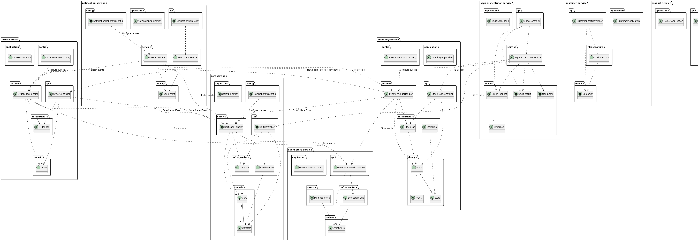

# Rapport - LAB7 Architecture Événementielle

**Auteur** : Youcef mekki daouadji 
**Lien github** : https://github.com/Mdyoucef99/LAB6_LOG430 : BRANCH Lab7
---

## 1. Scénario Métier Retenu

### Contexte
Système e-commerce moderne nécessitant une gestion robuste des transactions distribuées pour le processus de commande.

### Scénario Métier
**Processus de Commande E-commerce** :
1. **Client** ajoute des produits à son panier
2. **Système** valide le panier (existence, contenu)
3. **Système** réserve le stock disponible
4. **Système** crée la commande
5. **Système** vide le panier
6. **Client** reçoit confirmation

## 2. Vue Cas d'Utilisation


## 3. Vue Logique


## 4. Vue de Déploiement


## 5. Vue d'Implémentation


## 6. Diagramme de Séquence


---

## 7. Architecture Événementielle

### Composants Clés

#### 1. **Pub/Sub (RabbitMQ)**
- **Exchange** : `saga.events` 

  - `order.queue` : Événements de commande
  - `cart.queue` : Événements de panier
  - `inventory.queue` : Événements d'inventaire
  - `event.store.queue` : Stockage d'événements

#### 2. **Event Store**
- **Service dédié** : `event-store-service`
- **Base de données** : PostgreSQL avec table `events`
- **Fonctionnalités** :
  - Stockage de tous les événements
  - Relecture d'événements
  - Audit trail complet

#### 3. **Saga Chorégraphiée**
- **Communication asynchrone** : Via événements RabbitMQ
- **Décision locale** : Chaque service décide de ses actions
- **Compensation** : Gestion automatique des échecs

### Saga Chorégraphiée Implémentée

**Définition :** La saga chorégraphiée coordonne le processus de commande via des événements publiés par chaque service, sans orchestrateur central.

**Étapes de la Saga :**
1. **Validation du Panier** (cart-service) : Écoute `OrderStartedEvent`, valide le panier, publie `CartValidatedEvent`
2. **Réservation du Stock** (inventory-service) : Écoute `CartValidatedEvent`, réserve le stock, publie `StockReservedEvent`
3. **Création de la Commande** (order-service) : Écoute `StockReservedEvent`, crée la commande, publie `OrderCreatedEvent`
4. **Nettoyage du Panier** (cart-service) : Écoute `OrderCreatedEvent`, vide le panier, publie `CartClearedEvent`

**Gestion des Échecs et Compensation :**
- **Échec de validation** : `CartValidationFailedEvent` → Arrêt de la saga
- **Échec de réservation** : `StockReservationFailedEvent` → Compensation automatique
- **Échec de création** : Compensation automatique du stock réservé

---

## 8. ADR (Architectural Decision Records)

### ADR-001 : Utilisation de RabbitMQ comme Message Broker

**Statut** : Accepté  
**Contexte** : Le système nécessite une communication asynchrone fiable entre microservices pour la saga chorégraphiée.

**Décision** : Utiliser RabbitMQ comme message broker principal.

**Raisons** :
- **Fiabilité** : Garantie de livraison des messages
- **Flexibilité** : Support de différents patterns d'échange
- **Performance** : Excellentes performances pour les événements
- **Monitoring** : Interface de gestion intégrée
- **Maturité** : Solution éprouvée en production

**Alternatives considérées** :
- **Apache Kafka** : Trop complexe pour nos besoins
- **ActiveMQ** : Moins de fonctionnalités avancées
- **Redis Pub/Sub** : Pas de garantie de livraison

**Conséquences** :
-  **Positives** :
  - Communication asynchrone fiable
  - Monitoring intégré
  - Support des patterns avancés
-  **Négatives** :
  - Complexité d'administration
  - Dépendance externe

---

### ADR-002 : Implémentation de la Saga Chorégraphiée

**Statut** : Accepté  
**Contexte** : Le système e-commerce nécessite de gérer des transactions distribuées avec une coordination décentralisée entre les services.

**Décision** : Implémenter une saga chorégraphiée où chaque service publie des événements pour déclencher les actions des autres services.

**Raisons** :
- **Découplage** : Services indépendants et autonomes
- **Évolutivité** : Ajout facile de nouveaux services
- **Résilience** : Gestion locale des échecs
- **Simplicité** : Pas d'orchestrateur central

**Conséquences** :
-  **Positives** :
  - Services découplés
  - Évolutivité maximale
  - Résilience améliorée
-  **Négatives** :
  - Complexité de debugging
  - Eventual consistency
  - Gestion des événements perdus

---


## 9. Scénario de Test et Endpoints pour Logs

### Scénario de Test : Processus de Commande Complet

#### Phase 1 : Préparation des Données
```bash
# 1. Créer un produit
curl -X POST http://localhost:8080/api/v1/products \
  -H "Content-Type: application/json" \
  -d '{
    "name": "Laptop Gaming",
    "price": 1299.99,
    "category": "Electronics"
  }'

# 2. Créer un client
curl -X POST http://localhost:8080/api/v1/customers \
  -H "Content-Type: application/json" \
  -d '{
    "name": "Jean Dupont",
    "email": "jean.dupont@email.com"
  }'

# 3. Créer un panier
curl -X POST http://localhost:8080/api/v1/carts \
  -H "Content-Type: application/json" \
  -d '{
    "customerId": 1
  }'

# 4. Ajouter un article au panier
curl -X POST http://localhost:8080/api/v1/carts/1/items \
  -H "Content-Type: application/json" \
  -d '{
    "productId": 1,
    "quantity": 1
  }'
```

#### Phase 2 : Test de Succès de la Saga
```bash
# 5. Démarrer la saga chorégraphiée
curl -X POST http://localhost:8080/api/v1/orders/start-saga \
  -H "Content-Type: application/json" \
  -d '{
    "cartId": 1
  }'

# 6. Vérifier le résultat
curl -X GET http://localhost:8080/api/v1/orders

curl -X GET http://localhost:8080/api/v1/carts/1

curl -X GET http://localhost:8084/api/v1/events
```

#### Phase 3 : Test d'Échec (Compensation)
```bash
# 7. Créer un nouveau panier pour test d'échec
curl -X POST http://localhost:8080/api/v1/carts \
  -H "Content-Type: application/json" \
  -d '{
    "customerId": 1
  }'

# 8. Ajouter une quantité excessive (déclenche l'échec)
curl -X POST http://localhost:8080/api/v1/carts/2/items \
  -H "Content-Type: application/json" \
  -d '{
    "productId": 1,
    "quantity": 15
  }'

# 9. Démarrer la saga (va échouer)
curl -X POST http://localhost:8080/api/v1/orders/start-saga \
  -H "Content-Type: application/json" \
  -d '{
    "cartId": 2
  }'
```

#### Phase 4 : Test avec Panier Inexistant
```bash
# 10. Test avec panier inexistant
curl -X POST http://localhost:8080/api/v1/orders/start-saga \
  -H "Content-Type: application/json" \
  -d '{
    "cartId": 999
  }'
```

#### Phase 5 : Consultation des Événements
```bash
# 11. Consulter tous les événements
curl -X GET http://localhost:8084/api/v1/events

# 12. Consulter les événements par type
curl -X GET http://localhost:8084/api/v1/events/type/OrderStartedEvent

curl -X GET http://localhost:8084/api/v1/events/type/CartValidatedEvent

curl -X GET http://localhost:8084/api/v1/events/type/StockReservedEvent

curl -X GET http://localhost:8084/api/v1/events/type/OrderCreatedEvent

curl -X GET http://localhost:8084/api/v1/events/type/CartClearedEvent

# 13. Consulter les événements d'échec
curl -X GET http://localhost:8084/api/v1/events/type/CartValidationFailedEvent

curl -X GET http://localhost:8084/api/v1/events/type/StockReservationFailedEvent

# 14. Relecture d'une saga spécifique
curl -X GET http://localhost:8084/api/v1/events/saga/saga-456

# 15. Relecture d'un agrégat
curl -X GET http://localhost:8084/api/v1/events/replay/order/123
```

### Endpoints de Monitoring


## 10. Conclusion

Ce laboratoire aura été très bénéfique pour la compréhension de la saga chorégraphiée et les différences entre celle-ci et la saga orchestrée. L'architecture implémentée correspond bien à celle visée avec une saga chorégraphiée décentralisée utilisant RabbitMQ pour la communication événementielle.

Cependant, il faut noter qu'il existe encore beaucoup de bugs dans l'implémentation actuelle qui nécessitent d'être corrigés pour un déploiement en production. Ces bugs incluent des problèmes de compilation, des erreurs de configuration RabbitMQ, et des incohérences dans la gestion des événements.

Je n'ai pas eu non plus le temps d'implémenter d'interface utilisateur pour ce projet, du au volume des tâches qu'il fallait accomplir et au temps dont je disposais.

---

**Note** : Du à un manque de temps, je n'ai pas pu implémenter le CQRS ni ajouter les dashboards Grafana pour le labo 7. Ceux-ci se trouvent dans le rapport du labo 6 pour la saga orchestration. 